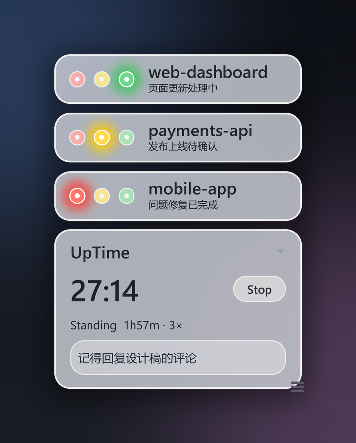
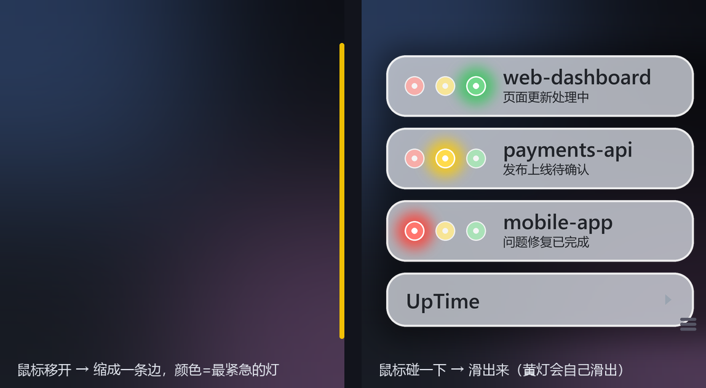

# AI 红绿灯

Windows 桌面悬浮窗，一眼看出每个项目里的 AI 编码助手当前在干什么。



每个项目一张半透明磨砂玻璃卡片，左边一组三色灯，右边是项目名和正在处理的内容：

| 灯色 | 含义 |
| --- | --- |
| 🟢 绿 | AI 正在干活 |
| 🟡 黄 | **AI 停下来了，而且不是它自己能解决的** —— 在等你批准、在问你问题、或者崩了 |
| 🔴 红 | 这一轮正常干完了，或者你自己按 Esc 叫停了 |

黄灯是这个工具的重点：它意味着**不去管它，它就永远停在那儿**。

项目列表来自 VSCode 当前打开的文件夹（自动发现）。

## 工作原理

hook 只是信号之一，**不是唯一来源**——因为钩子会漏。

```
Claude Code hooks ──► <项目>/.ai-status.json ─┐
                                              ├─► app.py（悬浮窗）
Claude transcript / Codex rollout ────────────┘
```

hook 在你发话、AI 要批准、AI 收工时写 `.ai-status.json`。但有几类情况 Claude Code **根本不触发任何 hook**，光靠钩子必然误判，所以悬浮窗还会去读会话 transcript 的尾部，看"球到底在谁手里"：

- **AI 在问你问题 / 等你批计划**：不发 `Notification`，钩子不响，文件还停在绿 → 光看钩子会一路绿灯。改为认尾部挂着的工具名（`AskUserQuestion` / `ExitPlanMode`）→ 黄。
- **API 报错死在半路**（掉线 / 证书错 / 403 / 限额）：报错记录长得跟正常收尾一模一样（`assistant` + 纯文本），会被读成"回合结束" → 红灯谎称"已完成"。改为认 `isApiErrorMessage` → 黄，卡片显示"已报错"。
- **进程被杀 / 窗口被关，卡在半截**：没有任何钩子会响 → 黄。
- **长命令正在跑**：transcript 期间一个字节都不写，拿"多久没动"判空闲会把正在干活的会话误判成红 → 所以只看尾部语义，不看修改时间。
- **自动重试的瞬时报错**（`system` / `api_error`）会被跳过，**不点黄灯**——否则黄灯就成了噪音。

Codex 没有 hook 机制，是直接读它的 rollout 文件判断的。

卡片上的文字是**工作概念**（如"代码提交""发布上线""工作流修复"），由 `status_hook.py` 里的 `ACTION_PATTERNS` 从你的输入里归纳出来，而不是回显你的原话。

## 隐私

`.ai-status.json` 会被写进**你每一个项目的根目录**，所以它里面只放能被别人看见的东西：

- **只存归纳后的概括词，不存你的原话。** 你说"帮我把报价单发给张总"，文件里存的是"邮件整理"。
- **不存带用户名的绝对路径。** transcript 路径存成 `~/...` 的相对形式。
- **自动加进 `.git/info/exclude`**，不会被 `git add .` 顺手提交进你的仓库。用的是这个本地忽略清单而不是 `.gitignore`，所以既不会误提交，也不会弄脏你自己维护的 `.gitignore`。

## 自定义词表

公司黑话、产品代号、项目显示名，放到 `rules.local.json`（不进版本库），**不要写进源码**——否则开源之后全世界都看得见你在做什么。把 `rules.example.json` 复制一份改名即可：

```json
{
  "actions": [["<产品代号>|<内部黑话>", "发版跟进"]],
  "labels": {"my-repo": "我的项目"}
}
```

`actions` 里的类目优先于内置类目；`labels` 把项目文件夹名换成卡片上的显示名。

渲染用 Pillow 超采样抗锯齿 + 高斯柔光，显示用 Win32 分层窗口做逐像素 alpha 透明。

## 安装（推荐：不需要 Python）

到 [Releases](../../releases) 下载 `AITrafficLight.exe`，双击运行。

首次运行会问你两件事：**要不要接入 Claude Code**（在 `~/.claude/settings.json` 里加三个 hook，改动前自动备份，你已有的 hook 和其他配置原样保留），以及**要不要开机自启**。同意之后就没有别的步骤了。

> Windows 会弹"已保护你的电脑"——这个 exe 没有代码签名证书（开源项目买不起）。点"更多信息"→"仍要运行"。介意的话可以照下面从源码跑，或自己构建。

## 从源码运行（开发用）

需要 Windows、Python 3.11+、Pillow：

```powershell
pip install Pillow
pythonw app.py
```

用 `pythonw`（而不是 `python`）启动，这样不会留一个黑色控制台窗口。首次运行同样会问你要不要接入 Claude Code。

自己构建 exe：

```powershell
pip install pyinstaller
pyinstaller --onefile --windowed --name AITrafficLight --hidden-import status_hook --hidden-import onboard app.py
```

## hook 是怎么接的

同一个可执行体兼任钩子——`AITrafficLight.exe --hook green` 就是钩子入口，所以用户机器上不需要 Python，也不用管 `status_hook.py` 放在哪。首次运行时会把这三个事件写进 `settings.json`：

| Hook 事件 | 灯色 | 含义 |
| --- | --- | --- |
| `UserPromptSubmit` | 🟢 绿 | 你发话了，AI 开始干活 |
| `Notification` | 🟡 黄 | AI 要你批准 |
| `Stop` | 🔴 红 | 这一轮干完了 |

想手动配或者想撤掉，直接编辑 `~/.claude/settings.json` 即可；程序不会覆盖你自己写的 hook。

Codex 不需要任何配置：它没有 hook 机制，悬浮窗是直接读它的 rollout 文件判断的。

## 悬浮窗操作

- **拖动**：按住卡片拖到任意位置，位置会被记住。
- **贴边收起**：把卡片拖到屏幕上/下/左/右边缘松手，它会吸附并缩进去，只在边上留一条细边。

  

  细边的颜色是所有项目里**最紧急**的那个状态（有黄就黄，否则有绿就绿，全干完才红），所以收起了也能一眼看出有没有事找你。鼠标碰一下细边，卡片滑出来；移开且没事找你，它自己滑回去。

  收起状态下有两种情况它会**自己滑出来**：

  - **任何项目转黄**（等你批准/输入）——一直挂着不收，你处理完它再缩回去。黄灯是持续状态，不理它就永远停在那儿。
  - **任何项目刚跑完转红**——滑出来报个到，5 秒后自动缩回去。红是静息态（闲着就是全红），所以只认"刚变红"这一下，不能像黄灯那样一直挂着，否则没活干的时候窗口就永远展开着。你自己按 Esc 叫停的、以及手动摁成红的灯不算——那是你自己干的，不用再提醒你。

  想取消贴边，把卡片拖回屏幕中间松手即可。停靠的边会被记住，下次启动仍是收起状态。
- **设置**：鼠标悬停到窗口右下角，会浮出透明度和大小滑块。

## 文件说明

| 文件 | 作用 |
| --- | --- |
| `app.py` | 悬浮窗本体：发现项目、判定灯色、绘制并显示卡片；`--hook <色>` 时兼任钩子 |
| `status_hook.py` | 钩子逻辑：把会话状态归纳成工作概念，写入 `.ai-status.json` |
| `onboard.py` | 首次运行的一键接入：合并 hook 进 `settings.json`（先备份）、可选开机自启 |
| `rules.example.json` | 私人词表模板，复制成 `rules.local.json` 即生效（不进版本库） |
| `启动红绿灯.vbs` | 开机自启脚本（无窗口启动 `pythonw app.py`）；用 exe 的话首次运行勾一下即可 |

`.ai-status.json`、`standup_log.json`、`standup_ui.json`、`widget.log` 都是运行时生成的本地状态，已在 `.gitignore` 中排除。
